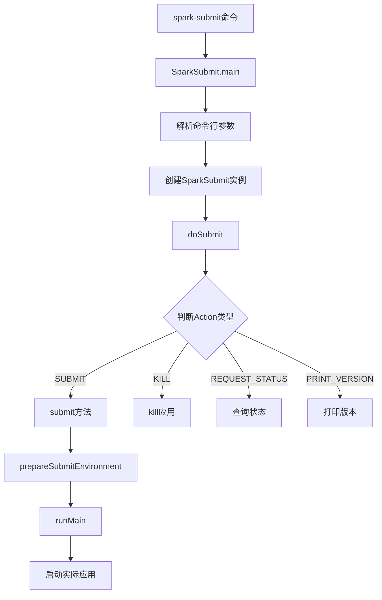
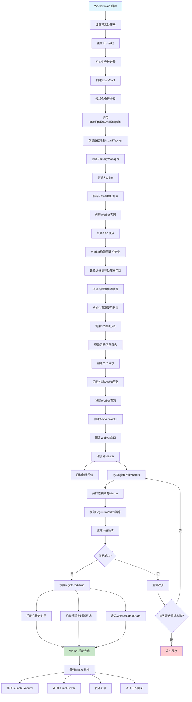
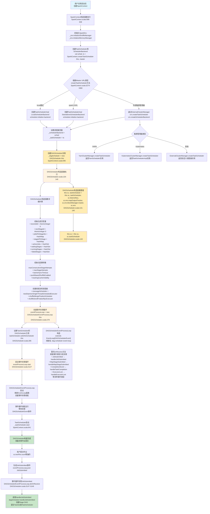

# spark提交流程

```mermaid
graph TD
    A[spark-submit命令] --> B[SparkSubmit.main]
    B --> C[解析命令行参数]
    C --> D[创建SparkSubmit实例]
    D --> E[doSubmit]
    E --> F{判断Action类型}
    F -->|SUBMIT| G[submit方法]
    F -->|KILL| H[kill应用]
    F -->|REQUEST_STATUS| I[查询状态]
    F -->|PRINT_VERSION| J[打印版本]
    G --> K[prepareSubmitEnvironment]
    K --> L[runMain]
    L --> M[启动实际应用]
```
# spark master main方法启动流程

```mermaid
flowchart TD
    A[程序启动 main方法] --> B[设置默认异常处理器]
    B --> C[重置结构化日志]
    C --> D[初始化守护进程]
    D --> E[创建SparkConf配置]
    E --> F[解析命令行参数 MasterArguments]
    
    F --> G[调用 startRpcEnvAndEndpoint]
    
    G --> H[创建SecurityManager]
    H --> I[创建RpcEnv 网络通信环境]
    I --> J[实例化Master对象]
    J --> K[注册Master为RPC端点]
    K --> L[获取绑定端口信息]
    
    L --> M[触发onStart方法]
    
    M --> N[启动MasterWebUI]
    N --> O{是否启用反向代理?}
    O -->|是| P[配置反向代理URL]
    O -->|否| Q[启动Worker超时检查定时任务]
    P --> Q
    
    Q --> R{是否启用REST服务器?}
    R -->|是| S[启动StandaloneRestServer]
    R -->|否| T[启动metrics监控系统]
    S --> T
    
    T --> U[创建持久化引擎和Leader选举代理]
    
    U --> V{恢复模式类型}
    V -->|ZOOKEEPER| W[ZooKeeper模式]
    V -->|FILESYSTEM| X[文件系统模式]
    V -->|ROCKSDB| Y[RocksDB模式]
    V -->|CUSTOM| Z[自定义模式]
    V -->|默认| AA[无持久化模式]
    
    W --> BB[启动Leader选举]
    X --> BB
    Y --> BB
    Z --> BB
    AA --> BB
    
    BB --> CC{是否当选为Leader?}
    CC -->|否| DD[保持STANDBY状态]
    CC -->|是| EE[ElectedLeader消息处理]
    
    EE --> FF[读取持久化数据]
    FF --> GG{是否有历史数据需要恢复?}
    
    GG -->|否| HH[直接进入ALIVE状态]
    GG -->|是| II[进入RECOVERING状态]
    
    II --> JJ[beginRecovery 开始恢复]
    JJ --> KK[恢复应用程序 ApplicationInfo]
    KK --> LL[恢复驱动程序 DriverInfo]
    LL --> MM[恢复Worker节点 WorkerInfo]
    MM --> NN[向各组件发送MasterChanged消息]
    
    NN --> OO{能否立即完成恢复?}
    OO -->|是| PP[completeRecovery 完成恢复]
    OO -->|否| QQ[设置恢复超时任务]
    
    QQ --> RR[等待Worker和应用响应]
    RR --> SS[接收状态更新消息]
    SS --> TT{收到所有响应?}
    TT -->|否| RR
    TT -->|是| PP
    
    PP --> UU[进入COMPLETING_RECOVERY状态]
    UU --> VV[移除无响应的Worker和应用]
    VV --> WW[更新应用状态为RUNNING]
    WW --> XX[重新调度孤立的驱动程序]
    XX --> HH
    
    HH --> YY[进入ALIVE状态 - 服务就绪]
    YY --> ZZ[开始调度 schedule方法]
    ZZ --> AAA[接受Worker注册]
    AAA --> BBB[接受应用提交]
    BBB --> CCC[进行资源调度和管理]
    
    DD --> DDD[等待成为Leader]
    DDD --> CC
    
    CCC --> EEE[等待程序终止 awaitTermination]
    
    style A fill:#e1f5fe
    style YY fill:#c8e6c9
    style EEE fill:#ffcdd2
    style CC fill:#fff3e0
    style GG fill:#f3e5f5
```
# spark worker main 方法启动流程

```mermaid
graph TD
    A[Worker.main 启动] --> B[设置异常处理器]
    B --> C[重置日志系统]
    C --> D[初始化守护进程]
    D --> E[创建SparkConf]
    E --> F[解析命令行参数]
    F --> G[调用startRpcEnvAndEndpoint]
    
    G --> H[创建系统名称 sparkWorker]
    H --> I[创建SecurityManager]
    I --> J[创建RpcEnv]
    J --> K[解析Master地址列表]
    K --> L[创建Worker实例]
    L --> M[设置RPC端点]
    
    M --> N[Worker构造函数初始化]
    N --> O[设置退役信号处理器可选]
    O --> P[创建线程池和调度器]
    P --> Q[初始化资源使用状态]
    
    Q --> R[调用onStart方法]
    R --> S[记录启动信息日志]
    S --> T[创建工作目录]
    T --> U[启动外部Shuffle服务]
    U --> V[设置Worker资源]
    V --> W[创建WorkerWebUI]
    W --> X[绑定Web UI端口]
    X --> Y[注册到Master]
    Y --> Z[启动指标系统]
    
    Y --> AA[tryRegisterAllMasters]
    AA --> BB[并行连接所有Master]
    BB --> CC[发送RegisterWorker消息]
    CC --> DD[处理注册响应]
    
    DD --> EE{注册成功?}
    EE -->|是| FF[设置registered=true]
    EE -->|否| GG[重试注册]
    GG --> HH{达到最大重试次数?}
    HH -->|否| AA
    HH -->|是| II[退出程序]
    
    FF --> JJ[启动心跳定时器]
    FF --> KK[启动清理定时器可选]
    FF --> LL[发送WorkerLatestState]
    
    JJ --> MM[Worker启动完成]
    KK --> MM
    LL --> MM
    
    MM --> NN[等待Master指令]
    NN --> OO[处理LaunchExecutor]
    NN --> PP[处理LaunchDriver]
    NN --> QQ[发送心跳]
    NN --> RR[清理工作目录]

    style A fill:#e1f5fe
    style MM fill:#c8e6c9
    style II fill:#ffcdd2
```
# spark 提交流程及对应代码方法

```mermaid
graph TD
    A[spark-submit 命令启动] --> B[SparkSubmit.main]
    B --> C[创建SparkSubmit实例]
    C --> D[调用doSubmit方法]
    
    D --> E[解析命令行参数<br/>parseArguments]
    E --> F[创建SparkConf配置]
    F --> G[设置日志系统]
    G --> H{判断操作类型}
    
    H -->|SUBMIT| I[submit方法]
    H -->|KILL| J[kill方法]
    H -->|REQUEST_STATUS| K[requestStatus方法]
    H -->|PRINT_VERSION| L[printVersion方法]
    
    I --> M{是否有代理用户?}
    M -->|是| N[处理代理用户权限]
    M -->|否| O[直接执行]
    N --> O
    
    O --> P{是否为Standalone集群模式<br/>且使用REST?}
    P -->|是| Q[尝试REST提交协议]
    P -->|否| R[执行runMain]
    
    Q --> S{REST连接成功?}
    S -->|是| R
    S -->|否| T[回退到传统RPC模式<br/>重新提交]
    T --> R
    
    R --> U[调用prepareSubmitEnvironment<br/>准备提交环境]
    
    U --> V[确定集群管理器类型]
    V --> W{集群管理器类型}
    W -->|YARN| X[YARN集群配置]
    W -->|STANDALONE| Y[Standalone集群配置]
    W -->|KUBERNETES| Z[Kubernetes集群配置]
    W -->|LOCAL| AA[本地模式配置]
    
    X --> BB[确定部署模式]
    Y --> BB
    Z --> BB
    AA --> BB
    
    BB --> CC{部署模式}
    CC -->|CLIENT| DD[客户端模式配置]
    CC -->|CLUSTER| EE[集群模式配置]
    
    DD --> FF[处理Maven依赖]
    EE --> FF
    
    FF --> GG[解析和下载资源文件]
    GG --> HH[处理JAR包和其他依赖]
    HH --> II[确定主类名称]
    
    II --> JJ{应用类型}
    JJ -->|Python应用| KK[设置PythonRunner]
    JJ -->|R应用| LL[设置RRunner]
    JJ -->|Java/Scala应用| MM[使用用户指定主类]
    
    KK --> NN[构建classpath和参数]
    LL --> NN
    MM --> NN
    
    NN --> OO[创建类加载器]
    OO --> PP[加载应用主类]
    
    PP --> QQ{主类加载成功?}
    QQ -->|否| RR[抛出ClassNotFoundException]
    QQ -->|是| SS[创建SparkApplication实例]
    
    SS --> TT[调用app.start启动应用]
    
    TT --> UU{不同部署模式启动}
    UU -->|Client模式| VV[在当前进程启动Driver]
    UU -->|Cluster模式-YARN| WW[YarnClusterApplication]
    UU -->|Cluster模式-Standalone| XX[ClientApp或RestSubmissionClientApp]
    UU -->|Cluster模式-K8s| YY[KubernetesClientApplication]
    
    VV --> ZZ[应用程序开始执行]
    WW --> AAA[提交到YARN ResourceManager]
    XX --> BBB[提交到Standalone Master]
    YY --> CCC[提交到Kubernetes集群]
    
    AAA --> DDD[YARN启动ApplicationMaster]
    BBB --> EEE[Master调度Driver]
    CCC --> FFF[K8s创建Driver Pod]
    
    DDD --> GGG[ApplicationMaster启动Driver]
    EEE --> GGG
    FFF --> GGG
    
    GGG --> ZZ
    ZZ --> HHH[创建SparkContext]
    HHH --> III[提交作业给集群]
    
    J --> JJJ[终止指定应用]
    K --> KKK[查询应用状态]
    L --> LLL[打印版本信息]
    
    RR --> MMM[退出程序]
    
    style A fill:#e1f5fe
    style ZZ fill:#c8e6c9
    style RR fill:#ffcdd2
    style MMM fill:#ffcdd2
```
# 用户执行spark-submit命令

```mermaid
graph TD
    A["用户执行spark-submit命令"] --> B["SparkSubmit.main方法<br/>设置IPv6偏好"]
    B --> C["创建SparkSubmit实例<br/>覆盖日志方法"]
    C --> D["调用doSubmit方法<br/>SparkSubmit.doSubmit"]
    
    D --> E["解析命令行参数<br/>parseArguments<br/>创建SparkSubmitArguments"]
    E --> F["生成SparkConf配置<br/>appArgs.toSparkConf"]
    F --> G["配置日志系统<br/>Utils.resetStructuredLogging"]
    G --> H["初始化日志<br/>initializeLogIfNecessary"]
    
    H --> I{判断操作类型<br/>appArgs.action}
    I -->|SUBMIT| J["调用submit方法"]
    I -->|KILL| K["调用kill方法<br/>RestSubmissionClient.killSubmission<br/>或SparkSubmitUtils.getSubmitOperations"]
    I -->|REQUEST_STATUS| L["调用requestStatus方法<br/>RestSubmissionClient.requestSubmissionStatus"]
    I -->|PRINT_VERSION| M["调用printVersion方法<br/>输出版本信息"]
    
    J --> N{是否有代理用户<br/>args.proxyUser != null}
    N -->|是| O["处理代理用户权限<br/>UserGroupInformation.createProxyUser<br/>proxyUser.doAs"]
    N -->|否| P["直接调用doRunMain"]
    O --> P
    
    P --> Q{是否为Standalone集群模式且使用REST<br/>args.isStandaloneCluster && args.useRest}
    Q -->|是| R["尝试REST提交协议<br/>logInfo REST protocol"]
    Q -->|否| S["调用runMain方法"]
    
    R --> T{REST连接成功?}
    T -->|是| S
    T -->|否| U["回退到传统RPC模式<br/>args.useRest = false<br/>递归调用submit"]
    U --> S
    
    S --> V["调用prepareSubmitEnvironment<br/>准备提交环境<br/>返回4元组"]
    
    V --> W["确定集群管理器类型<br/>args.maybeMaster匹配"]
    W --> X{集群管理器类型}
    X -->|yarn| Y["YARN = 1<br/>检查YARN_CLUSTER_SUBMIT_CLASS可加载性"]
    X -->|spark开头| Z["STANDALONE = 2"]
    X -->|k8s开头| AA["KUBERNETES = 16<br/>Utils.checkAndGetK8sMasterUrl<br/>检查KUBERNETES_CLUSTER_SUBMIT_CLASS"]
    X -->|local开头| BB["LOCAL = 8"]
    
    Y --> CC["确定部署模式<br/>args.deployMode匹配"]
    Z --> CC
    AA --> CC
    BB --> CC
    
    CC --> DD{部署模式}
    DD -->|client或null| EE["CLIENT = 1"]
    DD -->|cluster| FF["CLUSTER = 2"]
    
    EE --> GG["验证模式组合兼容性<br/>clusterManager, deployMode匹配"]
    FF --> GG
    
    GG --> HH["处理Maven依赖<br/>DependencyUtils.resolveMavenDependencies<br/>mergeFileLists合并JAR列表"]
    
    HH --> II["处理R包<br/>RPackageUtils.checkAndBuildRPackage"]
    II --> JJ["处理Kerberos认证<br/>UserGroupInformation.loginUserFromKeytab"]
    JJ --> KK["解析Glob路径<br/>resolveGlobPaths"]
    
    KK --> LL{部署模式 == CLIENT?}
    LL -->|是| MM["下载远程文件到本地<br/>downloadFile, downloadFileList<br/>处理K8s集群模式Driver资源下载"]
    LL -->|否| NN["处理YARN资源下载<br/>shouldDownload检查<br/>downloadResource方法"]
    
    MM --> OO["确定应用主类<br/>从JAR Manifest获取Main-Class<br/>或使用用户指定主类"]
    NN --> OO
    
    OO --> PP{应用类型判断}
    PP -->|Python应用<br/>args.isPython| QQ["设置PythonRunner主类<br/>org.apache.spark.deploy.PythonRunner<br/>处理py文件参数"]
    PP -->|R应用<br/>args.isR| RR["设置RRunner主类<br/>org.apache.spark.deploy.RRunner<br/>处理R文件和包"]
    PP -->|Java/Scala应用| SS["使用用户指定主类<br/>args.mainClass"]
    
    QQ --> TT["构建OptionAssigner列表<br/>映射参数到系统属性和命令行选项"]
    RR --> TT
    SS --> TT
    
    TT --> UU{部署模式判断}
    UU -->|CLIENT模式| VV["设置childMainClass = args.mainClass<br/>添加主JAR到childClasspath<br/>添加用户参数到childArgs"]
    UU -->|CLUSTER模式| WW["根据集群管理器设置不同的childMainClass"]
    
    WW --> XX{集群管理器类型}
    XX -->|YARN| YY["childMainClass = YARN_CLUSTER_SUBMIT_CLASS<br/>添加--primary-py-file, --jar, --class等参数"]
    XX -->|STANDALONE| ZZ["childMainClass = REST_CLUSTER_SUBMIT_CLASS<br/>或STANDALONE_CLUSTER_SUBMIT_CLASS<br/>添加launch, master等参数"]
    XX -->|KUBERNETES| AAA["childMainClass = KUBERNETES_CLUSTER_SUBMIT_CLASS<br/>添加--primary-java-resource, --main-class等参数"]
    
    VV --> BBB["返回prepareSubmitEnvironment结果<br/>childArgs, childClasspath, sparkConf, childMainClass"]
    YY --> BBB
    ZZ --> BBB
    AAA --> BBB
    
    BBB --> CCC["runMain方法开始执行<br/>获取准备好的环境参数"]
    CCC --> DDD["配置详细日志输出<br/>logInfo输出主类、参数、配置、classpath"]
    DDD --> EEE["创建类加载器<br/>getSubmitClassLoader<br/>MutableURLClassLoader或ChildFirstURLClassLoader"]
    EEE --> FFF["将JAR添加到classpath<br/>addJarToClasspath循环处理"]
    
    FFF --> GGG["加载应用主类<br/>Utils.classForName(childMainClass)"]
    GGG --> HHH{主类加载成功?}
    HHH -->|否| III["抛出ClassNotFoundException<br/>特殊处理thriftserver和connect相关错误"]
    HHH -->|是| JJJ["创建SparkApplication实例<br/>检查是否实现SparkApplication接口<br/>否则创建JavaMainApplication"]
    
    JJJ --> KKK["调用app.start启动应用<br/>传入childArgs和sparkConf"]
    
    KKK --> LLL{不同部署模式执行}
    LLL -->|Client模式| MMM["在当前进程启动Driver<br/>直接执行用户主类"]
    LLL -->|Cluster模式-YARN| NNN["YarnClusterApplication.start<br/>提交到YARN ResourceManager<br/>创建ApplicationMaster"]
    LLL -->|Cluster模式-Standalone| OOO["RestSubmissionClientApp.start<br/>或ClientApp.start<br/>提交到Standalone Master"]
    LLL -->|Cluster模式-K8s| PPP["KubernetesClientApplication.start<br/>创建Driver Pod提交到K8s"]
    
    MMM --> QQQ["应用程序开始执行<br/>用户代码运行"]
    NNN --> RRR["YARN启动ApplicationMaster<br/>AM启动Driver进程"]
    OOO --> SSS["Master调度Driver到Worker<br/>Worker启动Driver进程"]
    PPP --> TTT["K8s创建Driver Pod<br/>Pod内启动Driver进程"]
    
    RRR --> UUU["Driver创建SparkContext<br/>开始执行用户应用逻辑"]
    SSS --> UUU
    TTT --> UUU
    QQQ --> UUU
    
    UUU --> VVV["SparkContext提交作业到集群<br/>任务执行完成"]
    
    K --> WWW["任务终止完成"]
    L --> XXX["状态查询完成"]
    M --> YYY["版本信息输出完成"]
    III --> ZZZ["程序异常退出"]
    
    style A fill:#e1f5fe
    style VVV fill:#c8e6c9
    style WWW fill:#c8e6c9
    style XXX fill:#c8e6c9
    style YYY fill:#c8e6c9
    style III fill:#ffcdd2
    style ZZZ fill:#ffcdd2
```
# spark 提交完成后集群执行流程

```mermaid
graph TD
    A[SparkSubmit完成提交] --> B{集群管理器类型}
    
    B -->|Standalone集群模式| C[RestSubmissionClientApp或ClientApp<br/>向Master提交应用]
    B -->|YARN集群模式| D[YarnClusterApplication<br/>向ResourceManager提交]
    B -->|Kubernetes集群模式| E[KubernetesClientApplication<br/>向K8s API Server提交]
    
    %% Standalone模式流程
    C --> F[Master接收提交请求<br/>创建DriverInfo]
    F --> G[Master调度Driver<br/>选择合适的Worker]
    G --> H[Master发送LaunchDriver消息<br/>给选中的Worker]
    
    H --> I[Worker接收LaunchDriver<br/>创建DriverRunner]
    I --> J[DriverRunner.start<br/>启动Driver进程]
    J --> K[DriverRunner创建ProcessBuilder<br/>启动DriverWrapper进程]
    
    K --> L[DriverWrapper.main启动<br/>解析参数: workerUrl, userJar, mainClass, extraArgs]
    L --> M[创建SparkConf和RpcEnv<br/>val rpcEnv = RpcEnv.create Driver]
    M --> N[设置WorkerWatcher端点<br/>rpcEnv.setupEndpoint workerWatcher<br/>监控Worker状态]
    
    N --> O[设置类加载器<br/>ChildFirstURLClassLoader或MutableURLClassLoader<br/>加载用户JAR]
    O --> P[setupDependencies<br/>解析Maven依赖<br/>下载JAR到本地<br/>添加到classpath]
    
    P --> Q[加载用户主类<br/>Utils.classForName mainClass<br/>获取main方法]
    Q --> R[调用用户main方法<br/>mainMethod.invoke null, extraArgs]
    
    %% YARN模式流程
    D --> S[ResourceManager接收提交<br/>分配ApplicationMaster容器]
    S --> T[NodeManager启动ApplicationMaster<br/>运行ApplicationMaster.main]
    T --> U[ApplicationMaster初始化<br/>创建Driver线程]
    U --> V[启动Driver线程<br/>执行用户主类]
    
    %% Kubernetes模式流程
    E --> W[K8s接收Pod创建请求<br/>调度Driver Pod到节点]
    W --> X[kubelet启动Driver Pod<br/>运行Driver容器]
    X --> Y[容器内启动Driver进程<br/>执行用户主类]
    
    %% 用户应用启动阶段
    R --> Z[用户代码开始执行<br/>创建SparkContext]
    V --> Z
    Y --> Z
    
    Z --> AA[SparkContext初始化<br/>连接到集群管理器]
    AA --> BB{集群管理器类型}
    
    BB -->|Standalone| CC[连接到Master<br/>注册Application<br/>获取Worker信息]
    BB -->|YARN| DD[通过ApplicationMaster<br/>申请Executor容器]
    BB -->|Kubernetes| EE[通过K8s API<br/>创建Executor Pod]
    
    CC --> FF[Master调度Executor<br/>发送LaunchExecutor给Worker]
    DD --> GG[NodeManager启动Executor<br/>在分配的容器中]
    EE --> HH[kubelet启动Executor Pod<br/>在K8s节点上]
    
    FF --> II[Worker启动ExecutorRunner<br/>创建Executor进程]
    GG --> JJ[容器中启动CoarseGrainedExecutorBackend<br/>连接到Driver]
    HH --> JJ
    
    II --> KK[Executor连接到Driver<br/>注册并等待任务]
    JJ --> KK
    
    KK --> LL[SparkContext提交Job<br/>DAGScheduler创建Stage]
    LL --> MM[TaskScheduler分发Task<br/>到各个Executor]
    MM --> NN[Executor执行Task<br/>返回结果给Driver]
    NN --> OO[Job执行完成<br/>应用程序结束]
    
    %% WorkerWatcher监控流程
    N --> PP[WorkerWatcher监控Worker<br/>检测Worker状态]
    PP --> QQ{Worker是否断开}
    QQ -->|是| RR[WorkerWatcher.disassociated<br/>System.exit 1<br/>Driver进程退出]
    QQ -->|否| PP
    
    %% 异常处理
    RR --> SS[Driver进程异常退出]
    
    style A fill:#e1f5fe
    style OO fill:#c8e6c9
    style SS fill:#ffcdd2
    style L fill:#fff3e0
    style M fill:#fff3e0
    style N fill:#fff3e0
    style O fill:#fff3e0
    style P fill:#fff3e0
    style Q fill:#fff3e0
    style R fill:#fff3e0
```
# 创建SparkContext

```mermaid
graph TD
    A["用户应用启动后<br/>创建SparkContext"] --> B["SparkContext构造函数执行<br/>SparkContext.scala:588-638"]
    
    B --> C["初始化SparkEnv<br/>_env.initializeShuffleManager<br/>_env.initializeMemoryManager"]
    
    C --> D["创建TaskScheduler和SchedulerBackend<br/>val sched, ts = SparkContext.createTaskScheduler this, master"]
    
    D --> E{根据Master URL类型<br/>createTaskScheduler方法<br/>SparkContext.scala:3274-3360}
    
    E -->|local模式| F["创建TaskSchedulerImpl<br/>LocalSchedulerBackend<br/>scheduler.initialize backend"]
    E -->|spark://URL| G["创建TaskSchedulerImpl<br/>StandaloneSchedulerBackend<br/>scheduler.initialize backend"]
    E -->|外部集群管理器| H["通过ExternalClusterManager<br/>cm.createTaskScheduler<br/>cm.createSchedulerBackend"]
    
    F --> I["设置调度器变量<br/>_schedulerBackend = sched<br/>_taskScheduler = ts"]
    G --> I
    H --> I
    
    I --> J["创建DAGScheduler实例<br/>_dagScheduler = new DAGScheduler this<br/>SparkContext.scala:595"]
    
    J --> K["DAGScheduler构造函数执行<br/>DAGScheduler.scala:126-140"]
    
    K --> L["DAGScheduler构造函数详细步骤"]
    
    L --> M["初始化成员变量<br/>• nextJobId = AtomicInteger 0<br/>• nextStageId = AtomicInteger 0<br/>• jobIdToStageIds = HashMap<br/>• stageIdToStage = HashMap<br/>• activeJobs = HashSet<br/>• waitingStages = HashSet<br/>• runningStages = HashSet<br/>• failedStages = HashSet"]
    
    M --> N["初始化配置参数<br/>• maxConsecutiveStageAttempts<br/>• maxStageAttempts<br/>• barrierSyncTimeout<br/>• pushBasedShuffleEnabled<br/>• trackingCacheVisibility"]
    
    N --> O["创建线程池和调度器<br/>• messageScheduler = newDaemonSingleThreadScheduledExecutor<br/>• shuffleMergeFinalizeScheduler<br/>• shuffleSendFinalizeRpcExecutor"]
    
    O --> P["创建事件处理循环<br/>eventProcessLoop = new DAGSchedulerEventProcessLoop this<br/>DAGScheduler.scala:278"]
    
    P --> Q["设置TaskScheduler的DAGScheduler引用<br/>taskScheduler.setDAGScheduler this<br/>DAGScheduler.scala:285"]
    
    Q --> R["启动事件处理循环<br/>eventProcessLoop.start<br/>DAGScheduler.scala:3127"]
    
    R --> S["DAGSchedulerEventProcessLoop启动<br/>继承EventLoop基类<br/>创建事件处理线程"]
    
    S --> T["事件循环线程运行<br/>等待处理DAGSchedulerEvent事件"]
    
    T --> U["TaskScheduler启动<br/>_taskScheduler.start<br/>SparkContext.scala:641"]
    
    U --> V["DAGScheduler构建完成<br/>准备处理作业提交"]
    
    %% 事件处理分支
    V --> W["用户提交作业<br/>sc.textFile.count等操作"]
    W --> X["生成JobSubmitted事件<br/>eventProcessLoop.post JobSubmitted"]
    X --> Y["事件循环处理JobSubmitted<br/>DAGSchedulerEventProcessLoop.doOnReceive<br/>DAGScheduler.scala:3147-3149"]
    
    Y --> Z["调用handleJobSubmitted<br/>dagScheduler.handleJobSubmitted<br/>创建Stage DAG<br/>提交TaskSet到TaskScheduler"]
    
    %% 构造函数详细说明
    K --> AA["DAGScheduler构造函数重载<br/>this sc, taskScheduler = <br/>this sc, taskScheduler, sc.listenerBus,<br/>sc.env.mapOutputTracker, sc.env.blockManager.master, sc.env<br/>DAGScheduler.scala:131-140"]
    
    AA --> BB["this sc = this sc, sc.taskScheduler<br/>DAGScheduler.scala:143"]
    
    %% 关键组件初始化
    P --> CC["DAGSchedulerEventProcessLoop构造<br/>extends EventLoop[DAGSchedulerEvent]<br/>线程名: dag-scheduler-event-loop"]
    
    CC --> DD["重写onReceive方法<br/>根据事件类型分发处理<br/>• JobSubmitted → handleJobSubmitted<br/>• MapStageSubmitted → handleMapStageSubmitted<br/>• CompletionEvent → handleTaskCompletion<br/>• ExecutorLost → handleExecutorLost<br/>等多种事件类型"]
    
    %% 集群管理器创建详细流程
    H --> EE{集群管理器类型}
    EE -->|YARN| FF["YarnClusterManager.createTaskScheduler<br/>返回YarnScheduler实例"]
    EE -->|Kubernetes| GG["KubernetesClusterManager.createTaskScheduler<br/>返回TaskSchedulerImpl实例"]
    EE -->|其他| HH["ExternalClusterManager.createTaskScheduler<br/>返回自定义调度器实例"]
    
    style A fill:#e1f5fe
    style V fill:#c8e6c9
    style Z fill:#c8e6c9
    style K fill:#fff3e0
    style P fill:#fff3e0
    style R fill:#fff3e0
    style J fill:#ffecb3
    style AA fill:#ffecb3
    style BB fill:#ffecb3
```
# spark 构建job流程

```mermaid
graph TD
    A[用户调用Action操作<br/>如: rdd.count, rdd.collect等] --> B[RDD.count方法<br/>RDD.scala:1302<br/>sc.runJob this, Utils.getIteratorSize _]
    
    B --> C[SparkContext.runJob方法调用<br/>SparkContext.scala:2467-2495<br/>所有Action操作的统一入口]
    
    C --> D[SparkContext.runJob核心逻辑<br/>• 检查SparkContext状态<br/>• 获取CallSite调用栈信息<br/>• 清理闭包函数<br/>• 记录开始日志]
    
    D --> E[调用DAGScheduler.runJob<br/>SparkContext.scala:2484<br/>dagScheduler.runJob rdd, cleanedFunc, partitions, callSite, resultHandler, localProperties.get]
    
    E --> F[DAGScheduler.runJob方法<br/>DAGScheduler.scala:982-1011<br/>同步等待Job完成]
    
    F --> G[DAGScheduler.submitJob方法<br/>DAGScheduler.scala:925-968<br/>异步提交Job返回JobWaiter]
    
    G --> H[submitJob核心处理<br/>• 验证分区ID有效性<br/>• 提前计算RDD分区信息<br/>• 生成唯一JobId<br/>• 创建JobWaiter对象]
    
    H --> I[发送JobSubmitted事件<br/>DAGScheduler.scala:964-968<br/>eventProcessLoop.post JobSubmitted]
    
    I --> J[DAGSchedulerEventProcessLoop<br/>处理JobSubmitted事件<br/>DAGScheduler.scala:3147-3149]
    
    J --> K[调用handleJobSubmitted方法<br/>DAGScheduler.scala:1320-1380<br/>Job处理的核心逻辑]
    
    K --> L[handleJobSubmitted详细步骤]
    
    L --> M[1. 检查Job组是否被取消<br/>jobGroupIdOpt.exists cancelledJobGroups.contains]
    
    M --> N[2. 创建最终Stage<br/>finalStage = createResultStage finalRDD, func, partitions, jobId, callSite<br/>DAGScheduler.scala:1341]
    
    N --> O[createResultStage方法<br/>DAGScheduler.scala:646-658<br/>构建DAG的核心步骤]
    
    O --> P[createResultStage详细过程]
    
    P --> Q[1. 获取Shuffle依赖和资源配置<br/>val shuffleDeps, resourceProfiles = getShuffleDependenciesAndResourceProfiles rdd]
    
    Q --> R[2. 检查Barrier Stage限制<br/>• checkBarrierStageWithDynamicAllocation<br/>• checkBarrierStageWithNumSlots<br/>• checkBarrierStageWithRDDChainPattern]
    
    R --> S[3. 创建父Stage列表<br/>val parents = getOrCreateParentStages shuffleDeps, jobId]
    
    S --> T[getOrCreateParentStages方法<br/>递归创建所有父Stage<br/>shuffleDeps.map getOrCreateShuffleMapStage]
    
    T --> U[4. 创建ResultStage对象<br/>new ResultStage id, rdd, func, partitions, parents, jobId, callSite, resourceProfile.id]
    
    U --> V[5. 注册Stage到全局映射<br/>• stageIdToStage id = stage<br/>• updateJobIdStageIdMaps jobId, stage]
    
    V --> W[回到handleJobSubmitted<br/>3. 创建ActiveJob对象<br/>val job = new ActiveJob jobId, finalStage, callSite, listener, artifacts, properties]
    
    W --> X[4. 更新全局状态<br/>• jobIdToActiveJob jobId = job<br/>• activeJobs += job<br/>• finalStage.setActiveJob job]
    
    X --> Y[5. 发送JobStart事件<br/>listenerBus.post SparkListenerJobStart]
    
    Y --> Z[6. 提交Stage执行<br/>submitStage finalStage<br/>DAGScheduler.scala:1460]
    
    Z --> AA[submitStage方法<br/>DAGScheduler.scala:1461-1498<br/>递归提交Stage的核心逻辑]
    
    AA --> BB[submitStage详细处理]
    
    BB --> CC[1. 检查Stage状态<br/>确保不在waitingStages, runningStages, failedStages中]
    
    CC --> DD[2. 获取缺失的父Stage<br/>val missing = getMissingParentStages stage]
    
    DD --> EE{是否有缺失的父Stage?}
    
    EE -->|有| FF[递归提交父Stage<br/>for parent <- missing<br/>  submitStage parent<br/>waitingStages += stage]
    
    EE -->|无| GG[提交当前Stage的Task<br/>submitMissingTasks stage, jobId.get<br/>DAGScheduler.scala:1494]
    
    FF --> HH[父Stage完成后<br/>会重新触发当前Stage提交]
    
    GG --> II[submitMissingTasks方法<br/>DAGScheduler.scala:1547-1742<br/>创建Task并提交到TaskScheduler]
    
    II --> JJ[submitMissingTasks详细步骤]
    
    JJ --> KK[1. 清理中间状态<br/>处理不确定性ShuffleMapStage的重新计算]
    
    KK --> LL[2. 查找缺失分区<br/>val partitionsToCompute = stage.findMissingPartitions]
    
    LL --> MM[3. 配置Stage属性<br/>• runningStages += stage<br/>• 配置输出提交协调器<br/>• 处理Shuffle合并设置]
    
    MM --> NN[4. 计算Task位置偏好<br/>val taskIdToLocations = getPreferredLocs stage.rdd, partitionId]
    
    NN --> OO[5. 序列化Task广播变量<br/>根据Stage类型序列化不同内容:<br/>• ShuffleMapStage: rdd, shuffleDep<br/>• ResultStage: rdd, func]
    
    OO --> PP[6. 创建Task对象]
    
    PP --> QQ{Stage类型?}
    
    QQ -->|ShuffleMapStage| RR[创建ShuffleMapTask<br/>new ShuffleMapTask stage.id, stage.latestInfo.attemptNumber, taskBinary, part, stage.numPartitions, locs...]
    
    QQ -->|ResultStage| SS[创建ResultTask<br/>new ResultTask stage.id, stage.latestInfo.attemptNumber, taskBinary, part, stage.numPartitions, locs...]
    
    RR --> TT[7. 提交TaskSet到TaskScheduler<br/>taskScheduler.submitTasks new TaskSet tasks.toArray, stage.id, stage.latestInfo.attemptNumber, jobId, properties...]
    
    SS --> TT
    
    TT --> UU[TaskScheduler.submitTasks<br/>TaskSchedulerImpl.scala:185<br/>将TaskSet分发到集群执行]
    
    UU --> VV[TaskScheduler创建TaskSetManager<br/>管理TaskSet的执行和重试]
    
    VV --> WW[SchedulerBackend.reviveOffers<br/>向集群申请资源执行Task]
    
    WW --> XX[Executor执行Task<br/>返回结果给Driver]
    
    XX --> YY[Task完成后处理<br/>DAGScheduler.handleTaskCompletion<br/>更新Stage状态]
    
    YY --> ZZ{Stage是否完成?}
    
    ZZ -->|否| AA1[继续等待其他Task完成]
    ZZ -->|是| BB1[处理Stage完成<br/>标记Stage为完成状态]
    
    BB1 --> CC1{是否还有未完成的Stage?}
    
    CC1 -->|是| DD1[提交下一个Stage<br/>submitWaitingChildStages]
    CC1 -->|否| EE1[Job完成<br/>调用listener.jobSucceeded]
    
    DD1 --> GG
    
    HH --> GG
    
    AA1 --> XX
    
    %% 异常处理分支
    M --> FF1[Job组被取消<br/>listener.jobFailed]
    N --> GG1[Stage创建失败<br/>listener.jobFailed]
    OO --> HH1[Task序列化失败<br/>abortStage]
    
    style A fill:#e1f5fe
    style EE1 fill:#c8e6c9
    style FF1 fill:#ffcdd2
    style GG1 fill:#ffcdd2
    style HH1 fill:#ffcdd2
    style O fill:#fff3e0
    style AA fill:#fff3e0
    style II fill:#fff3e0
    style TT fill:#ffecb3
```

